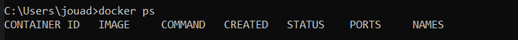
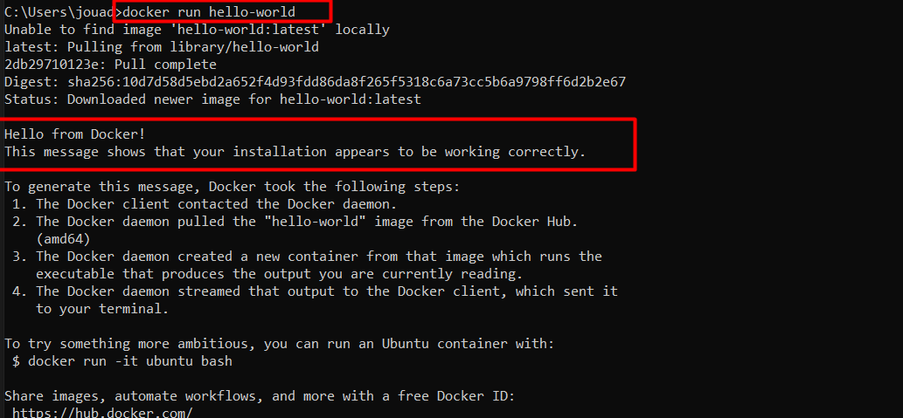

# Instalacion-Docker

_Docker ps_ para comprobar la versión y nuestros contenedores.

Ejecutamos _Docker run hello-world_ para el clásico hello world.

Recursos: 
- https://docs.docker.com/desktop/windows/install/
- https://www.thecodebuzz.com/docker-error-daemon-is-not-running/ -> En caso de error
- https://labs.play-with-docker.com --> Para pruebas
- https://aws.amazon.com/es/docker/ --> Para más información